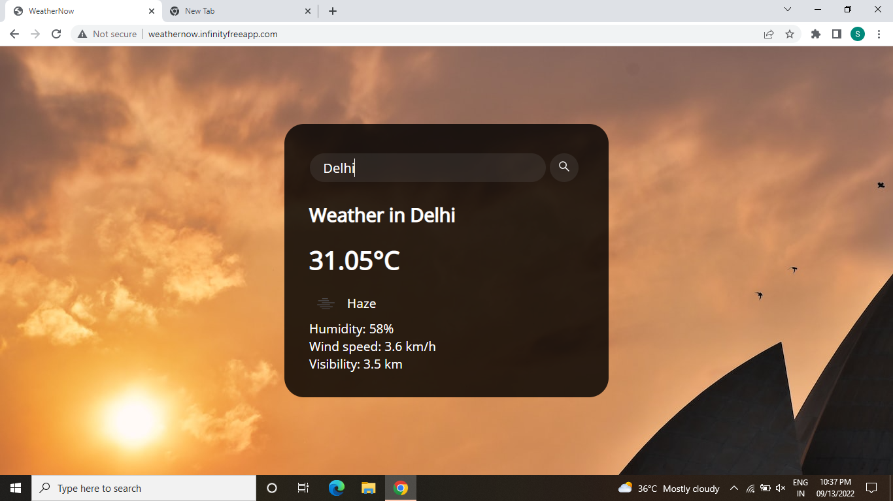

## Description

--> Designed an API based weather app called "WeatherNow" using HTML, CSS and JavaScript.

--> The IDE used is VidualStudio Code.

--> The source code files are index.html, style.css and script.js

--> The weather data is fetched from https://openweathermap.org/ through API calls.

--> The city-specific background images are fetched from https://source.unsplash.com/1600x900/?

--> When a query is made for a particular city, various weather-specific data such as temperature, humidity, wind speed, visibility, etc. are fethced and displayed for that city.

## Website Link
http://weathernow.infinityfreeapp.com/

## UI Layout

